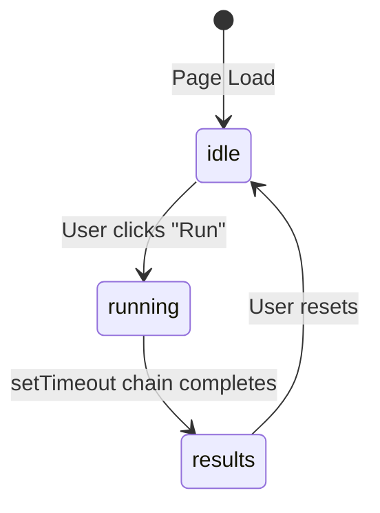
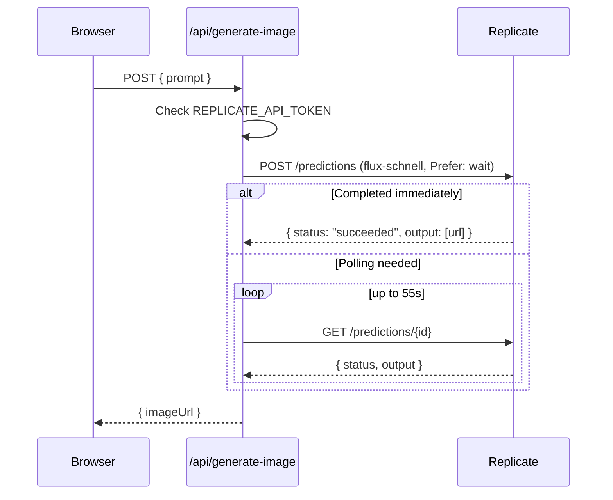
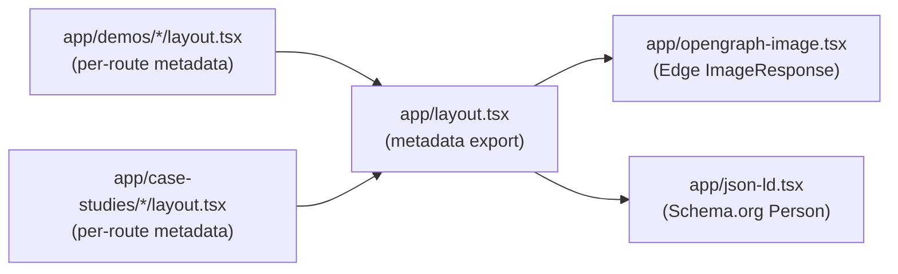
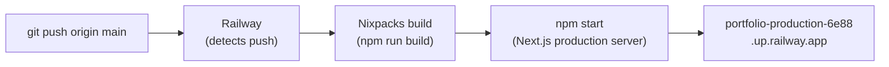

# Portfolio Architecture

> **Last Verified**: 2026-04-06

## System Diagram

```mermaid
graph TD
    subgraph Browser["Browser"]
        NAV[Navigation]
        HERO[Hero]
        DEMOS_SECTION[Demos Section]
        CS_SECTION[CaseStudies Section]
        CONTACT[Contact]
        TUTORIAL[TutorialOverlay]
    end

    subgraph Pages["Next.js Pages (App Router)"]
        HOME["/ (page.tsx)"]
        DEMOS_IDX["/demos (index)"]
        CM["/demos/creative-matrix"]
        BT["/demos/budget-tracker"]
        PPC["/demos/ppc-auditor"]
        PT["/demos/proofing-tool"]
        AE["/demos/upwork/ad-engine"]
        CE["/demos/upwork/construction-estimator"]
        CS_IDX["/case-studies (index)"]
        ATLAS["/case-studies/atlas-platform"]
        MEDIA["/case-studies/media-operations"]
        AGENCY["/case-studies/agency-transformation"]
        OG["/opengraph-image (Edge)"]
    end

    subgraph Components["Shared Components"]
        CSL[CaseStudyLayout]
        TB[TerminalBlock]
        TO[TutorialOverlay]
    end

    subgraph API["API Routes"]
        GEN_IMG["POST /api/generate-image"]
    end

    subgraph External["External Services"]
        REPLICATE["Replicate API\n(flux-schnell)"]
    end

    HOME --> NAV & HERO & DEMOS_SECTION & CS_SECTION & CONTACT
    ATLAS & MEDIA & AGENCY --> CSL
    CM & BT & PPC & PT --> TO
    AE --> GEN_IMG
    GEN_IMG --> REPLICATE
    HOME --> OG
```



## Page Structure

### Home Page (`app/page.tsx`)

The home page is a single-scroll marketing page assembled entirely from components. It has no data fetching — all content is hardcoded in the component files.

```
page.tsx
  └── <Navigation />
  └── <Hero />           ← tagline, CTA buttons
  └── <About />
  └── <Experience />     ← timeline
  └── <Skills />
  └── <Demos />          ← card grid linking to /demos/*
  └── <CaseStudies />    ← card grid linking to /case-studies/*
  └── <Contact />
```

### Demo Pages (`app/demos/*/page.tsx`)

Each demo is a self-contained client component (`"use client"`). They share no state with each other or with the home page. All data (campaigns, audit checkpoints, mailer datasets) is defined inline as TypeScript constants at the top of each file.

The common pattern across all demos:

```
page.tsx (client component)
  ├── Static data constants (campaigns, checkpoints, briefs)
  ├── React state (phase, selectedItem, results)
  ├── Simulation logic (setTimeout chains, phase progression)
  ├── Recharts charts (BudgetTracker only)
  └── <TutorialOverlay steps={...} visible={...} onComplete={...} />
```

### Case Study Pages (`app/case-studies/*/page.tsx`)

All three case study pages use `CaseStudyLayout` as their outer wrapper. The layout accepts structured props (sections, metrics, tech stack, timeline) and renders them into a consistent visual structure.

```
page.tsx
  └── <CaseStudyLayout
        title="..."
        subtitle="..."
        metrics={[...]}
        sections={[...]}
        techStack={[...]}
      />
```

## Component Map

### `TutorialOverlay` (`components/TutorialOverlay.tsx`)

Spotlight-driven interactive tour engine. Renders a semi-transparent overlay with a hole cut around the current target element using `box-shadow`. Tooltip position is computed dynamically based on available viewport space.

**Props interface:**
```ts
interface Step {
  targetId: string;    // DOM element ID to spotlight
  title: string;
  content: string;
}

interface TutorialOverlayProps {
  steps: Step[];
  visible: boolean;
  onComplete: () => void;
}
```

**Positioning logic:**
1. On each step change, `document.getElementById(targetId)` is called to get the target's `getBoundingClientRect()`
2. If the element is off-screen, `scrollIntoView({ behavior: 'smooth', block: 'center' })` is called
3. Tooltip is placed below the target if `targetRect.bottom + 200 < viewportHeight`, otherwise above
4. Spotlight is achieved via `box-shadow: 0 0 0 9999px rgba(0,0,0,0.72)` on a positioned div

### `CaseStudyLayout` (`components/CaseStudyLayout.tsx`)

Reusable page wrapper that standardizes the visual structure of all case study pages. Accepts a typed props object and renders: a hero section, impact metrics bar, content sections (each with optional subsections), architecture diagram slot, tech stack tags, and bottom navigation.

### `TerminalBlock` (`components/TerminalBlock.tsx`)

Animated terminal-style code display with cursor blink. Used in the Hero section and case study pages to convey technical credibility. Renders monospace text with syntax-like coloring, an animated typing cursor, and optional line-by-line reveal timing.

### `Navigation` (`components/Navigation.tsx`)

Header component with scroll-aware background: transparent at top, dark blurred at scroll depth > 10px. Contains links to `#demos`, `#case-studies`, and `#contact` (same-page anchors on home) plus `/demos` and `/case-studies` for direct navigation.

## Interactive Demo Architecture

All demos follow the same **phase-based simulation pattern**:



Phase transitions are driven by `setTimeout` chains that update a `phase` state variable. Each phase change triggers different UI rendering (progress indicators, skeleton states, result panels). This creates the appearance of async AI processing without any real backend calls (except the Ad Engine which calls `/api/generate-image`).

**Example — PPC Auditor phase sequence:**
```
idle → "select account" → "choose scope" → "running audit" → "results"
```

**Example — Ad Engine phase sequence:**
```
idle → "analyzing brief" → "generating copy" → "composing ads" → "generating visuals" → "results"
```

## API Layer

### `/api/generate-image` (`app/api/generate-image/route.ts`)

The only real backend API in the project. Proxies image generation requests from the Ad Engine demo to Replicate.



The `Prefer: wait` header requests synchronous completion from Replicate. If not honored, the route polls every 2 seconds up to a 55-second timeout before returning a 500.

## SEO & Metadata Layer



**OG Image** (`app/opengraph-image.tsx`): Rendered at the Edge via Next.js `ImageResponse`. No external image hosting needed — the image is generated on-demand and cached. The file name `opengraph-image.tsx` is a Next.js convention; placing it in `app/` makes it the default OG image for the root route automatically.

**JSON-LD** (`app/json-ld.tsx`): Injects a `<script type="application/ld+json">` tag into `<head>` via `useEffect`. Uses `Schema.org/Person` type with `jobTitle`, `knowsAbout`, and `sameAs` (GitHub, LinkedIn). Cleaned up on unmount to avoid duplicate injection in development.

## Deployment Pipeline



Railway uses Nixpacks to auto-detect the Node.js project and runs the standard Next.js build. No Dockerfile or CI/CD configuration is needed beyond `railway.json`. The `restartPolicyType: "ON_FAILURE"` setting in `railway.json` provides automatic recovery from crashes.

**Environment variables** are set in the Railway project dashboard (not committed to the repo). Only `REPLICATE_API_TOKEN` is required at runtime.

## Key Design Decisions

### All demos are purely client-side (except Ad Engine)

The demos simulate AI agent behavior with scripted data and `setTimeout` chains rather than live API calls. This keeps the site fast, eliminates cold-start latency, and makes demos reproducible. The tradeoff is that the outputs are not actually generated by AI at demo time — but this is intentional: the demos showcase the *interface and workflow design* of real systems, not the AI inference itself.

### Case studies use a shared layout component

All three case study pages pass structured data into `CaseStudyLayout` rather than implementing layout from scratch. This enforces visual consistency and makes it trivial to add a fourth case study. The tradeoff is that highly unique page layouts would require modifying the shared component.

### Upwork demos are namespaced under `/demos/upwork/`

Demos built for specific client proposals are nested under `/upwork/` rather than promoted to the top-level `/demos/` namespace. This keeps the primary demo portfolio curated while still making proposal demos publicly accessible via direct link.

### OG image is generated at the Edge, not statically exported

Using `ImageResponse` means the OG card is always up-to-date with the latest stats without needing a rebuild. The Edge runtime ensures it renders fast globally. Static export would require re-building and re-deploying to update the card.

## Data Flow Summary

| Operation | Path | Auth | Data Sources |
|:----------|:-----|:-----|:-------------|
| View home page | Browser → `app/page.tsx` → components | None | Hardcoded in components |
| Run any demo (except Ad Engine) | Browser → `app/demos/*/page.tsx` | None | Inline TS constants |
| Generate image (Ad Engine) | Browser → `/api/generate-image` → Replicate | `REPLICATE_API_TOKEN` | Replicate Flux Schnell |
| View OG image | CDN/Bot → `app/opengraph-image.tsx` (Edge) | None | Hardcoded stats |
| Search engine indexing | Crawler → `app/json-ld.tsx` | None | Schema.org Person data |
